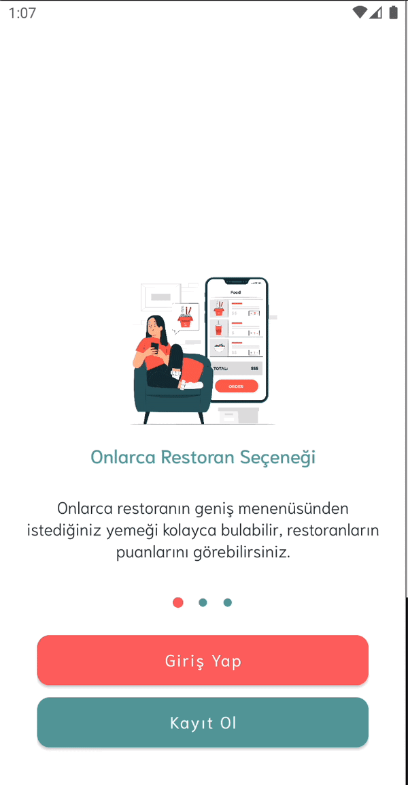
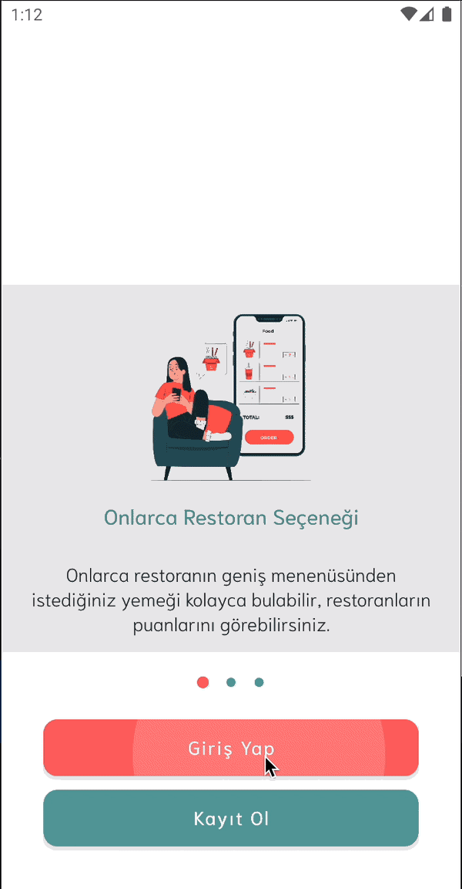

# FoodDeliveryFinal-nerminkemanci

This is an basic food delivery application which was developed for Kodluyoruz Yemeksepeti Android Bootcamp.
## Libraries
- Dagger&Hilt
- Retrofit
- OkHttp
- Navigation Component
- Glide 
- Coroutines
- View Pager 2
-Kotlin Safe Args

##Backand Side of Application
We have created a simple rest api server for the backend side of the application.  
Server's web address -> https://yummyfoodserver.herokuapp.com 
For restaurant list -> https://yummyfoodserver.herokuapp.com/restaurant/all 
For food list -> https://yummyfoodserver.herokuapp.com/food/all 
For orders list -> https://yummyfoodserver.herokuapp.com/order/all 

## OnBoarding Screen

## Sign in and Sign up Screens

## Sign in Screen

## Splash Home and Restaurant Listing Screens

